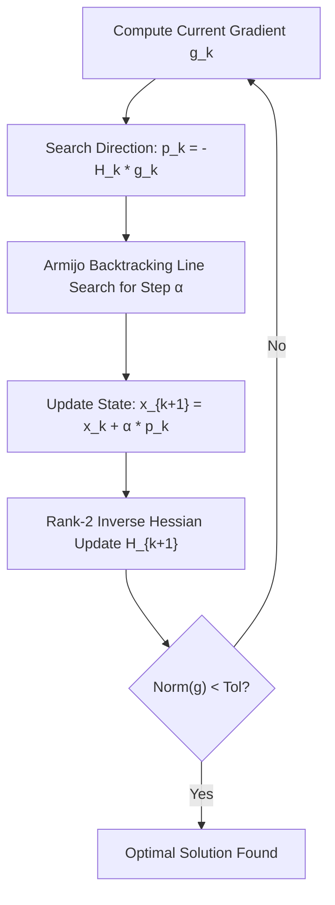

# BFGS Quasi-Newton Optimizer Skill

Broyden-Fletcher-Goldfarb-Shanno (BFGS) quasi-Newton optimization featuring rank-2 inverse Hessian approximation updates.

## Features
- **100% Python Standard Library**: No numpy or scipy required.
- **Superlinear Convergence**: Approximates Newton-Raphson curvature without computing explicit second derivatives.
- **Robust Armijo Line Search**: Guaranteed decrease in objective function.
